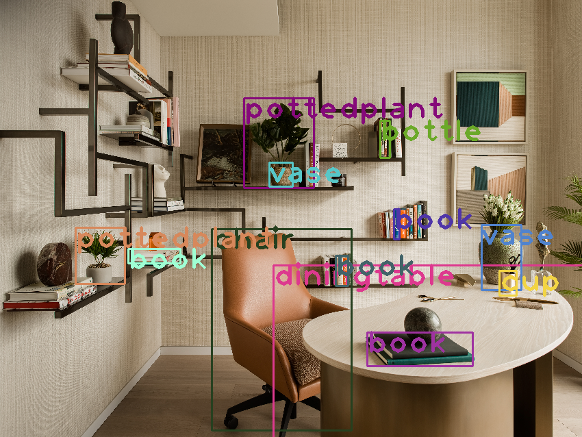

# YOLO Object Detection with OpenCV in Python



## Setup
1. Download and Install Python 3: [**Windows:** [Python](https://www.python.org/downloads) OR [Anaconda](https://www.anaconda.com/download)] [**Ubuntu:** Already Installed]
2. Install Required Dependencies:
   ```bash
   pip3 install numpy
   pip3 install opencv-contrib-python
   ```
3. Clone this repository and make it the current working directory:
   ```bash
   git clone https://github.com/Tinker-Twins/YOLO-OpenCV-Python.git
   cd YOLO-OpenCV-Python
   ```
4. Download [**yolov3.weights**](https://pjreddie.com/media/files/yolov3.weights) to the working directory:
   ```bash
   cd YOLO-OpenCV-Python
   wget -c https://pjreddie.com/media/files/yolov3.weights
   ```

## Execution
1. Move to the local clone of this repository:
   ```bash
   cd YOLO-OpenCV-Python
   ```
2. Execute the `object_detection.py` Python script:
   ```bash
   python3 object_detection.py
   ```
   > **Note:** To terminate the execution, press the `ESC` key while the `Object Detection` window is selected.
